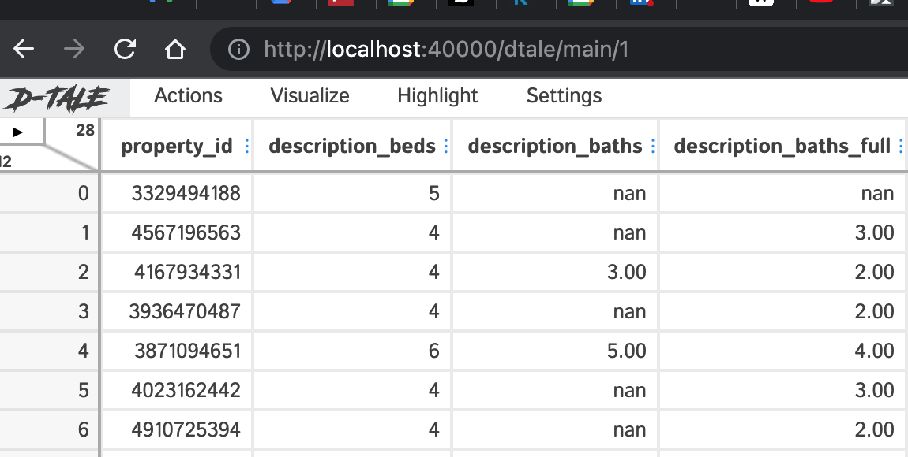

# house-data-scrape

 - scrapes house property data from a realtor.com website
 - saves to a timestamped csv file in the out folder
 - displays to browser using DTale

running the docker container:  

```
$ docker run -v $(pwd)/out:/app/out -p 40000:40000 house-data-scrape
```

open browser to localhost:40000  


